# Judge Searcher Scraper

This is a basic HOW-TO document to use the **Judge Searcher** application.

## Step 1:

Browse to the Judge search folder and open it.

## Step 2:

Once the folder is open locate the **JudgeSearcher.exe** and click it to launch the application.

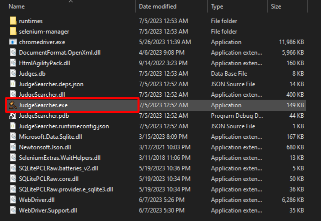

## Step 3:

Once the application is launched you should see the following application window.

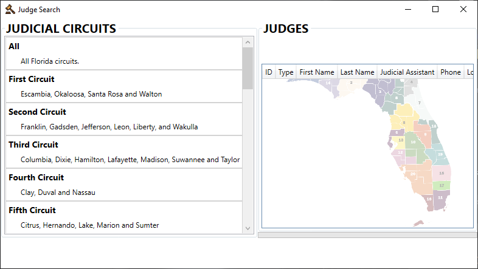

## Step 4:

In order to use the application you need to select one of the menu buttons on the left panel. When this is done **Clear, Export, Scrape** buttons will appear on the lower right of the application.

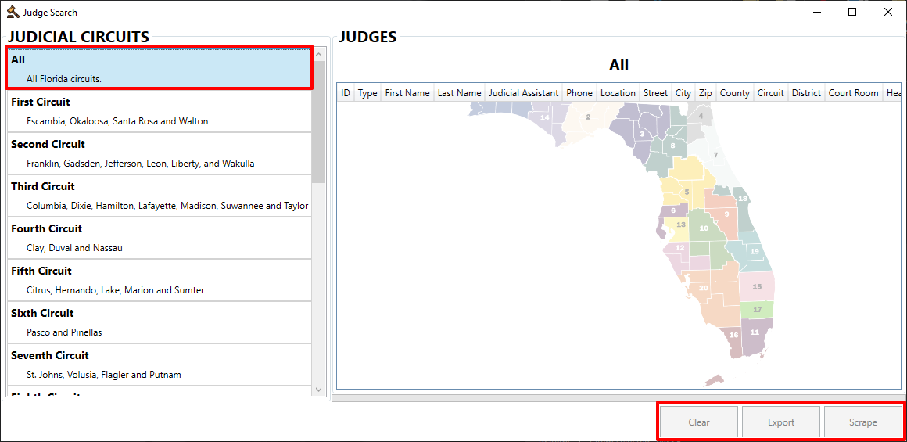

## Step 5:

The process of **Scraping** can only be executed once you have selected a menu item on the left panel. This will *Enable* the Scrape button from where scraping can be triggered.

    NOTE:

    Scraping cannot be executed when the "All" menu item is selected.

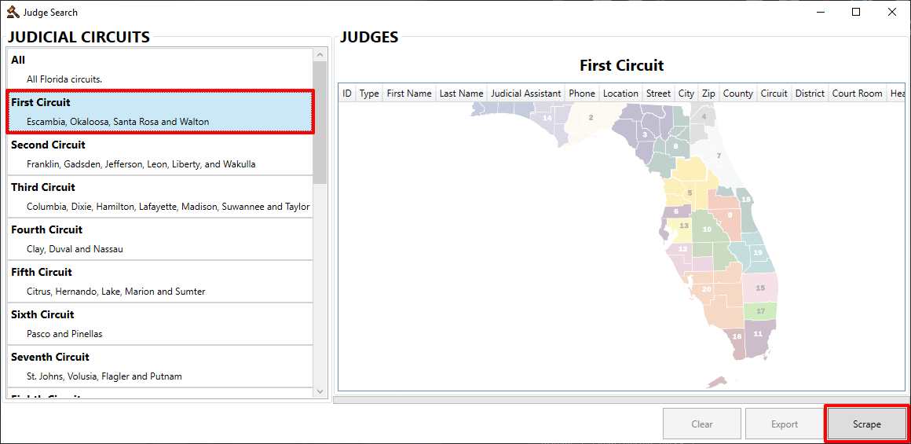

## Step 6:

1. Once the scraping process is triggered a console window will appear. This window is part of the scraping engine used to gather the information from the website. 

    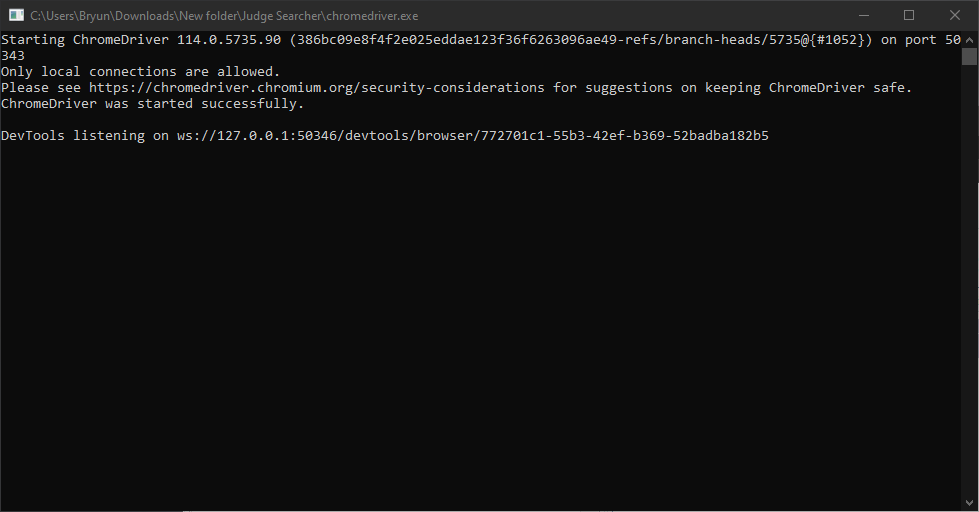

2. A browser window will also appear as a part of the scraping process and will change periodically as the scraping process is busy.

    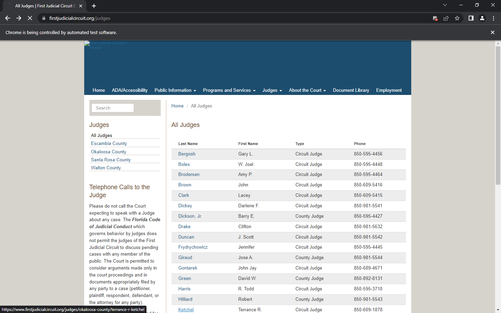

3. The application will show a busy progress indicator.

    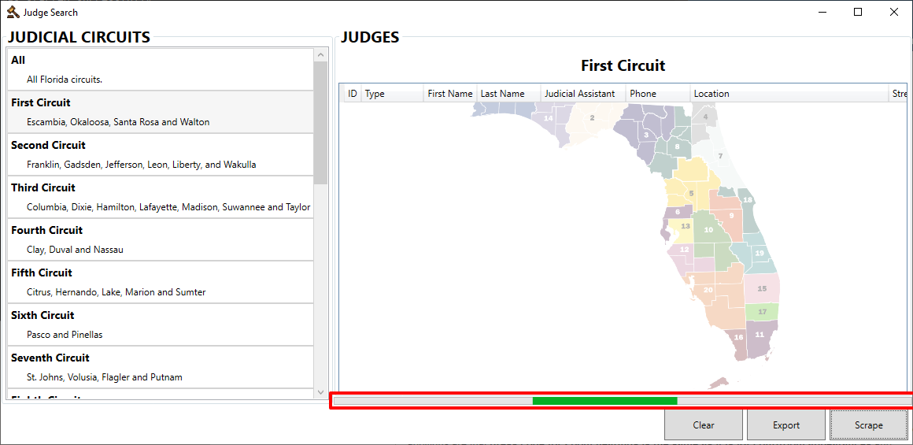

4. Once scraping has completed a success dialog will appear to notify the user.

    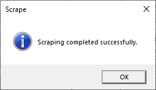

## Step 7:

When scraping has completed the grid which the right side of the screen will be populated with the collected information. And the data is also saved to a sqlite database. You will also notice the button on the bottom right are all enabled.

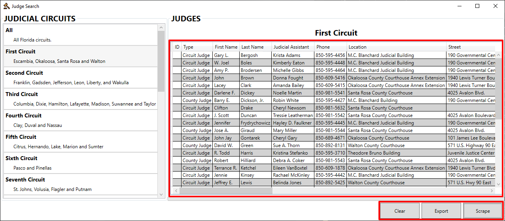

## Step 8:

1. If the **Export** button is clicked an Export dialog will appear on which a file name for an Excel file must be provided as well as the location the file must be created. Click **Save**.

    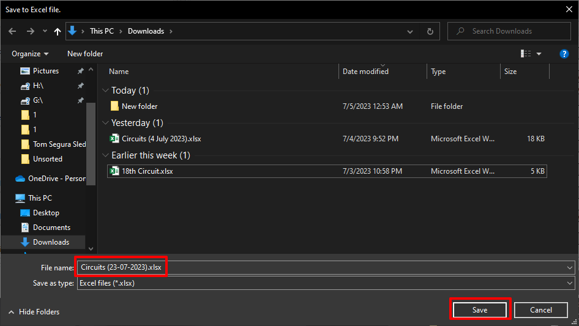

2. Once the export process is completed an success dialog will appear.

    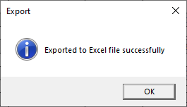

## Step 9:

In order to clear the grid and database of the collected information click on the clear button and a corresponding success dialog will appear.

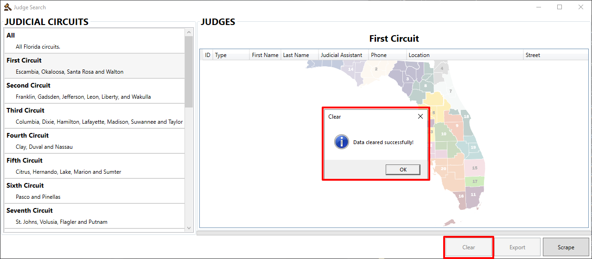

